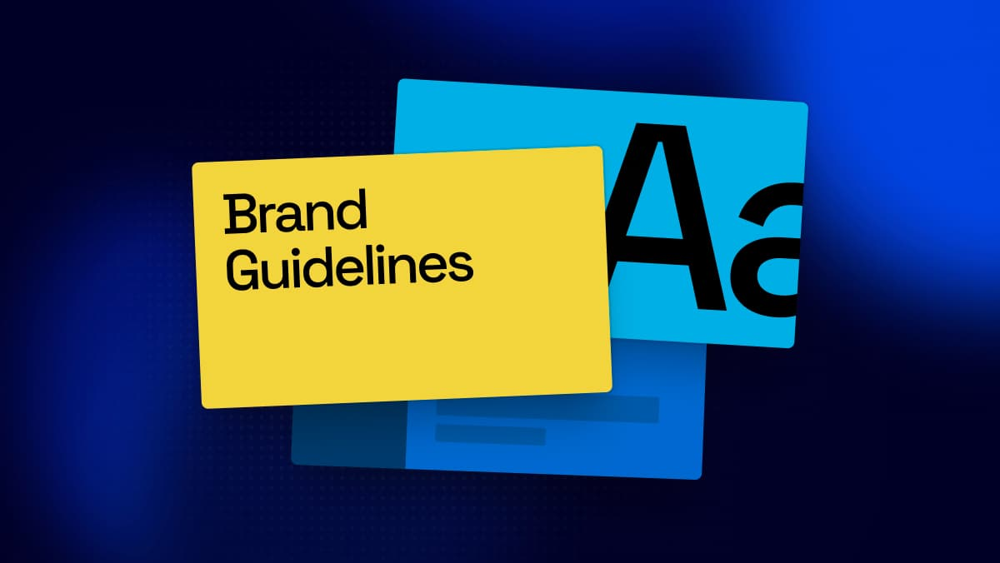

# assets/

Shared content for prototypes to draw on, so a screen that needs a deck does not
need someone to go and find one.

Four sets: **decks**, for anywhere a presentation has to appear; **features**, the media a
feature is sold with; **brand-kits**, for anywhere a screen applies somebody's branding; and
**logos**, the row of company logos a screen shows as social proof.

```
assets/
├── decks/
│   ├── README.md                 the four decks, and which to reach for
│   ├── index.json                every deck, its title, year, slide count, register and use
│   └── <slug>/
│       ├── thumb/01.jpg … 15.jpg   400 × 225,   quality 75
│       ├── card/01.jpg  … 15.jpg   800 × 450,   quality 78
│       └── full/01.jpg  … 15.jpg  1920 × 1080,  quality 82
├── brand-kits/
│   ├── README.md                 the four kits, and what may be done with them
│   ├── index.json                every kit, its palette and both logo paths
│   └── <slug>/logo.svg + logo-mono.svg
├── logos/
│   ├── README.md                 the nine logos, and the one rule the ticker needs
│   ├── index.json                every logo and its display name
│   └── <slug>.svg                the logo, as it arrived
└── features/
    ├── README.md                 the eighteen features, and how to stand in for a nineteenth
    ├── index.json                every feature, its label, media, kind and what it sells
    ├── <slug>.jpg                1200 × 676, one per feature
    └── <slug>.{mp4,webm}         1920 × 1080, three features only
```

**`brand-kits/` and `logos/` hold real trademarks.** Both are vendored for prototyping. A screen
built on a brand kit must not be presented as coming from that company, and a logo row must not be
shown as a customer claim unless the claim is true. Each folder's README has the rest.

**Each folder's `README.md` is the roster** — what is in it, what each one looks like, and which to
pick for a given screen. This file is the mechanics both share: sizes, formats, markup.

`features/` was `feature-modals/` until 4 Aug 2026. The media was never modal-only — a tile, a
card, an upsell row, a locked empty state all sell a feature the same way — and the old name kept
suggesting otherwise.

---

## decks/

Four decks, fifteen slides each, numbered `01`–`15`. Real presentations, 16:9, so a
grid of thumbnails or a slide on a canvas looks like the product rather than like grey
rectangles.

They are deliberately four different-looking decks — light and dense, loud and editorial, dark and
financial, minimal and structured. **Which one you pick is a decision**; [`decks/README.md`](decks/README.md)
is the table that makes it.

The numbering is the position in *this* set, not in the deck it came from — these are a
selection of pages, and carrying the source pagination would have meant a consumer
could not simply loop.

### Three sizes, and the number that decides which

**Pick by the widest the image will ever render, doubled.** Screens are 2× — a tile
laid out at 270 CSS pixels is 540 real ones, so a 400px source stretches and goes
soft. That is the whole rule; everything below follows from it.

| | | Good up to | For |
|---|---|---|---|
| `thumb` | 400 × 225 | 200 CSS px | filmstrips, dense lists, many at once |
| `card` | 800 × 450 | 400 CSS px | picker grids, deck cards |
| `full` | 1920 × 1080 | 960 CSS px | a canvas, a preview, one at a time |

`full` is the source resolution — there is nothing sharper to be had, so a canvas
wider than 960 CSS pixels will soften and no amount of re-exporting fixes it.

The sizes are 1.1 MB, 3.6 MB and 15 MB across all four decks. Reaching for `full`
in a grid is the mistake the split exists to prevent: twelve of them is 3 MB where
twelve cards is 750 KB, and at grid size they look identical.

`srcset` is worth using where a grid can be either — the picker in the sticker
sheet offers `thumb` and `card` and lets the browser decide.

### Why JPEG

They arrived as 1920 × 1080 PNGs, 27 MB across the four. PNG is lossless and
these are photographic — gradients, imagery, anti-aliased type — which is the
case it is worst at. JPEG at these sizes is 10 MB for both derivatives together,
and nothing about a slide thumbnail needs lossless.

The originals are not kept here. Re-deriving from a source PNG is a one-line
`sips` call; carrying 27 MB in git to avoid it is not a trade worth making.

### Using them

```html

```

`index.json` is there so a prototype can build a grid without hardcoding a list:

```js
const { decks } = await fetch("assets/decks/index.json").then(r => r.json());
```

Every slide is 16:9. Set `aspect-ratio: 16/10` on a container and the image will
letterbox — use `16/9` and it will not.

---

## features/

One image or clip per paid feature — the media shown next to a pitch. Eighteen features, each named
for what it sells rather than for the trigger that fires it: every source file was called
`trigger…`, which inside a folder where they all are carries no information.

**Every feature has a `<slug>.jpg` at 1200 × 676.** Three also have a clip. For
those three the still *is* the clip's first frame, so one file serves as both the
fallback image and the `poster` — a `<video>` without a poster shows black until it
buffers, and there is no reason to make a consumer find a second file for it.

| | |
|---|---|
| Stills | `assign-slides` `brand-kit` `colours` `comments` `fonts` `invite-members-free` `long-decks` `meet-and-edit` `meet-and-present` `pro-models` `project-knowledge` `projects` `refresh-from-source` `templates` `ultra-models` |
| Stills **and** clips | `analytics` `export` `invite-members` |

`invite-members` and `invite-members-free` are two different assets for related
triggers — the `-free` one is the free-plan variant and came as a still only.

**A feature that is not one of these eighteen still gets a picture from here.**
[`features/README.md`](features/README.md) maps what a feature sells to the nearest asset, and
grades each one by how safely it travels — an abstract illustration claims nothing about a screen,
a product-UI screenshot claims quite a lot.

### One size, and why the decks need three

1200 covers 600 CSS pixels at 2×, which is wider than any modal here goes — so the
[three-size split](#three-sizes-and-the-number-that-decides-which) the decks need
would buy nothing. A deck image has to work at both 200px in a filmstrip and 960px
on a canvas; a feature image has exactly one job at one size.

The clips are 1920 × 1080 H.264, ten to twenty-one seconds, and ship as both `mp4`
and `webm` because that is the pair the app serves. Every browser worth prototyping
in plays the `mp4` on its own, so **the `webm` is there for fidelity to production,
not because a prototype needs it** — it is 6.4 of the set's 15 MB, and dropping it
is a reasonable trade if this folder ever needs to get smaller.

### Using them

```html


<video poster="../assets/features/export.jpg" autoplay muted loop playsinline>
  <source src="../assets/features/export.webm" type="video/webm" />
  <source src="../assets/features/export.mp4"  type="video/mp4" />
</video>
```

`index.json` carries the label and, where there is one, the clip — so a screen can
resolve its media from the feature name without a hardcoded map:

```js
const { features } = await fetch("assets/features/index.json").then(r => r.json());
const media = features.find(f => f.slug === "export");   // → { still, clip: {mp4, webm}, … }
```

Every one is 16:9 within a pixel (1200 × 676 is 675.0 rounded up). Set
`aspect-ratio: 16/9` and nothing letterboxes.
