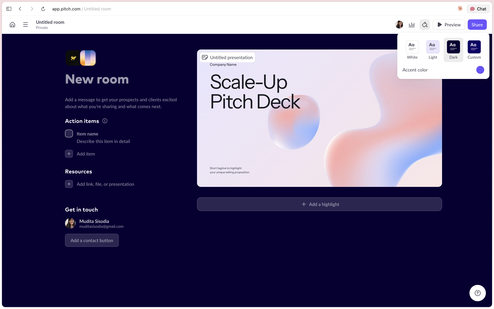
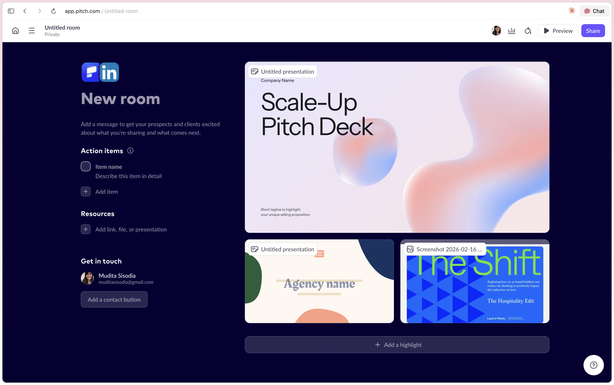
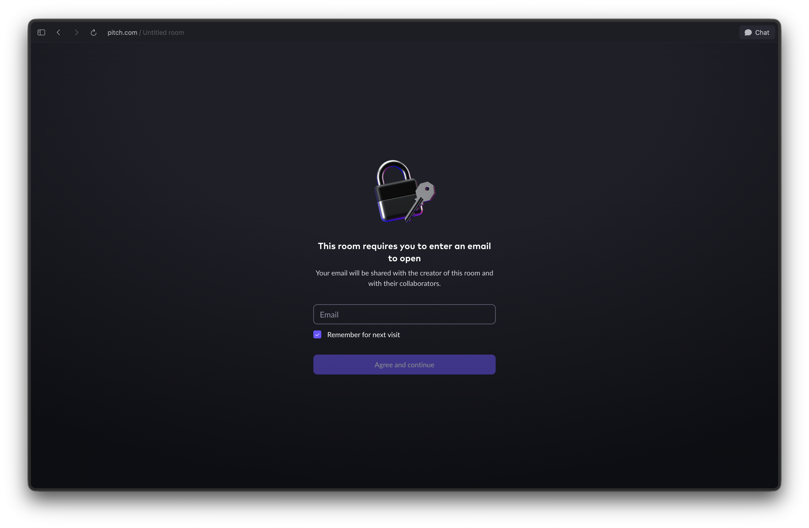

# Deal Room — grounding

**Type:** Shared grounding for this folder — reference, **not** source of truth · **Owner:** Mudita · **Updated:** 24 Jul 2026

The **deal room** itself: a per-deal, branded container that wraps a PAI deck + supporting assets + a Mutual Action Plan into one link. Engagement analytics is its own project — the room *consumes* it. See the [Deck Analytics grounding](../deck-analytics/grounding.html).

---

## Who is this for?

**Sales only** (unlike Analytics, which also serves Marketing + Leadership). The primary user is the **Account Executive** running a deal. Relevant *after* a deck exists, at the point the seller is working an opportunity.

| Role | Use |
|---|---|
| **Sales / AE** | the whole feature — run a live deal through one branded room |
| *Sales Engineer (adjacent, later)* | POC / pilot rooms — Phase 2 |
| *Customer Success (adjacent, later)* | onboarding handoff — Phase 2 (School B) |

**When it's relevant:**

```
CREATE FLOW  →  deck exists  →  seller working a deal  →  wraps it in a room
(not here)                       (demo → proposal stage)
```

The three roles the room must serve on the *buyer* side (why it exists):

```
CHAMPION ──► ECONOMIC BUYER ──► END USERS
your advocate   controls budget,   will use PAI;
(can't sign)    says final yes      their buy-in = champion's ammo
```

The room's job is to travel from the champion outward to the committee (avg ~6–10 people), especially the unseen economic buyer. The Mutual Action Plan is how the champion sells internally.

**Who exactly — first-timers, not mature sales teams (positioning · Dhruv ✓ 23 Jul 2026).** We are **not** building a sales-enablement tool, and **not** positioning against mature deal rooms (Showpad, Trumpet, Aligned). Pitch's own "rooms" positioning gave no compelling reason-to-choose, and there's no point fighting the mature DSRs on their turf. Our user has **never used a deal room** — their current workflow is: finish a presentation, send a PDF attachment. The deal room is the **natural next step after building a deck**: bundle the resources into one neat package and keep track of what happens next.

```
TODAY:  build deck → send a PDF attachment → lose the thread
OURS:   build deck → wrap in a room → share one link → see what happens next
```

So the target is the **first-time deal-room user, reached from the deck** — not the mature AE shopping for a DSR. The champion → committee model above still holds; it just plays out for a team doing this for the first time. (See [Positioning](#positioning-2x2) for the market whitespace this sits in, and [Tiering](#tiering--packaging) for how packaging mirrors this logic.)

---

## Who are the incumbents?

**Trumpet** (Pods), **Aligned** (DSR), **Dock**, **GetAccept**, plus **Pitch** on the design side.

## What are they doing?

- **One branded link per deal** bundling deck + assets + next steps.
- **Mutual Action Plan** — a shared checklist of steps to close.
- **Engagement tracking** inside the room.
- **Content bundling** — PDFs, videos, links, embeds.
- **(Trumpet/Qwilr) drag-and-drop page builder** — seller lays out a microsite.
- **(Dock) full journey** — sell → onboard → portal from one link; order forms / e-sign.

## What's relevant to us?

- the **one-link-per-deal container** + a **simple next-steps checklist** (this is the core)
- **content bundling** (deck + assets, with a hero)
- **room-scoped engagement** (reuse Deck Analytics)
- **minimal room lifecycle** (draft → active → archived)

**Not** relevant for V1: the page-builder, CRM sync, e-sign/order forms, the year-round hub. (See Phase 2.)

## What we play up (we're a presentation tool)

```
THEM: wrap a deck they didn't make (embed/link), let the seller build a page
US:   the deck is a LIVE NATIVE object, in an OPINIONATED templated room
```

- **Deck-native.** The most important object in the room (the deck) is ours — live, current, per-slide tracked. Theirs is a linked PDF.
- **Opinionated, not a builder.** We ship a well-designed room template; the seller drops content in. PAI makes the design calls — playing to our strength in opinionated layout, and killing the expensive off-brand page-builder surface.
- **Zero seam.** Make the deck → wrap it in a room → share, in one product.

---

## Feature matrix — jobs-to-be-done across incumbents

The whole competitor set on one grid, by **job to be done** (researched 23 Jul 2026). The last column is **PAI Phase 1** — deliberately the narrowest room. Read the `✗→E2 / ✗→V2` marks as *roadmap, not gap*.

**Legend:** ✓ has it · ◐ partial / tier-locked / basic · ✗ no · ? unconfirmed · →E2 / →V2 = on our roadmap, not Phase 1.

| Job to be done | Trumpet | Aligned | Dock | GetAccept | Recapped¹ | Flowla | Pitch² | **PAI · P1** |
|---|:-:|:-:|:-:|:-:|:-:|:-:|:-:|:-:|
| One link per deal (the room) | ✓ | ✓ | ✓ | ✓ | ✓ | ✓ | ✓ | **✓** |
| **Make the deck itself** (native authoring) | ✗ | ✗ | ✗ | ✗ | ✗ | ✗ | ✓ | **✓** |
| Bundle content (PDF · video · links · embeds) | ✓ | ✓ | ✓ | ✓ | ✓ | ✓ | ✓ | ✓ |
| Drag-drop page builder | ✓ | ✓ | ✓ | ✓ | ✓ | ✓ | ◐ | ✗ᵈ |
| Mutual Action Plan (shared checklist) | ✓ | ✓ | ✓ | ✓ | ✓ | ✓ | ◐ | ✓ |
| Rich MAP (owners · due dates · buyer-assigned) | ✓ | ✓ | ✓ | ✓ | ✓ | ✓ | ✗ | ✗→E2 |
| Timeline / Gantt view | ◐ | ? | ◐ | ◐ | ✓ | ✓ | ✗ | ✗ |
| Engagement analytics (per-viewer) | ✓ | ✓ | ✓ | ✓ | ✓ | ✓ | ✓ | ✓ |
| Buyer no-login access | ✓ | ✓ | ✓ | ✓ | ✓ | ✓ | ✓ | ✓ |
| Access gates (passcode · email · domain) | ✓ | ✓ | ✓ | ✓ | ◐ | ✓ | ✓ | ◐ |
| E-sign / order forms / quotes | ◐ | ◐ | ✓ | ✓ | ◐ | ◐ | ✗ | ✗→E2 |
| CRM sync (Salesforce · HubSpot, 2-way) | ✓ | ✓ | ✓ | ✓ | ✓ | ✓ | ✗ | ✗→V2 |
| Post-sale / onboarding portal | ✓ | ◐ | ✓ | ◐ | ✓ | ✓ | ✗ | ✗ᵃ |
| Templates (reusable rooms / MAPs) | ✓ | ✓ | ✓ | ✓ | ✓ | ✓ | ✓ | ◐ |
| Buyer invites own colleagues | ◐ | ◐ | ✓ | ✓ | ✓ | ✓ | ✗ | ◐ |
| Comments / two-sided collab | ✓ | ✓ | ✓ | ✓ | ✓ | ✓ | ◐ | ✗→E2 |
| White-label / custom domain | ✓ | ◐ | ✓ | ◐ | ◐ | ✓ | ◐ | ◐ |

¹ **Recapped is winding down** (shuts 31 Jul 2026, not taking new customers) — kept as a MAP-model reference, not a live threat.
² **Pitch is a deck-maker with a light "Rooms" layer, not a full DSR** — it's the design-side reference, which is why it's ✗ across the deal-workflow rows.
ᵈ ᵃ PAI ✗ by *decision*, not gap: **no page-builder** (opinionated template, not a builder) and **School A only** (freeze + clone, no year-round portal).

**What the grid says (the JTBD reading):**

- **MAP is table-stakes, not a wedge.** Every real DSR ships a rich MAP — it's the price of entry, not a differentiator. Our Phase-1 simple checklist is deliberately behind here; **rich MAP is our clearest E2 catch-up**.
- **"Make the deck itself" is ours alone — with Pitch.** Every DSR bundles a deck they can't author; only **Pitch and PAI** create it natively. That single row *is* the wedge. And Pitch has the deck but almost none of the deal workflow (✗ down its column), so **PAI is the only one positioned to hold both halves**.
- **A real timeline/Gantt is rare** — only **Flowla and Recapped** truly ship one; the rest fake it with a calendar or milestone view. Low priority for us.
- **E-sign + quotes/CPQ is where GetAccept and Dock lead** — the "close the paperwork" job, a heavy Phase-2+ lift we've correctly parked.
- **CRM sync is universal among DSRs and absent in the deck-makers** — it's the diagonal step onto the platform axis (see [Positioning](#positioning-2x2)); V2 for us.

**The one-column story:** PAI Phase 1 is intentionally the *narrowest* room — native deck + simple MAP + analytics + no-login — with a hard **no** on the platform surface (page-builder, rich MAP, e-sign, CRM, portal). Those ✗ marks are the thesis, not the backlog: win the creation corner first, add workflow later.

---

## Positioning (2×2)

A reference frame for where PAI sits and where these features move us. Axes chosen so **revenue is deliberately not one** (it's a lagging output, not a position):

```
X — MAKE the content ⟷ MOVE it       (creation ⟷ distribution & tracking)
Y — single artifact (point tool) ⟷   whole deal / revenue workflow (platform)
```

```
                    WHOLE DEAL / REVENUE WORKFLOW (platform)
                                   ▲
   ┌───────────────────────────────┼───────────────────────────────┐
   │  ░ WHITESPACE ░                │  Highspot · Seismic (enablmnt) │
   │  no deck-maker has a room —    │  PandaDoc · GetAccept (+e-sign)│
   │  the DEAL ROOM wedge           │  Trumpet·Aligned·Dock·Flowla·  │
   │  ↑ PAI heads up here           │  Recapped (DSR — deal workflow)│
 MAKE ─────────────────────────────┼───────────────────────────────── MOVE
   │ Pitch ··· Gamma · Beautiful.ai ····⟶ DocSend · Papermark       │
   │ (pure     Qwilr · Storydoc · ● PAI   (share + track one doc)   │
   │  create)  └─ ANALYTICS = table-stakes ─┘ (contested, not a wedge)│
   └───────────────────────────────┼───────────────────────────────┘
                                   ▼
                    SINGLE ARTIFACT (point tool)
```

**We sit bottom-left** with the deck-makers. Two different moves:

- **Analytics = table-stakes, not a wedge.** Gamma, Beautiful.ai and Qwilr already track — the creation corner has slid right into analytics. Ship it to complete the make→share→track loop and not look dated, but it won't differentiate PAI *from them*. (Beautiful.ai has even added Salesforce — the first step onto the diagonal.)
- **The Deal Room IS the wedge.** No deck-maker has a room + MAP; it's creation-side whitespace, *and* the move the DSRs can't easily counter (no native deck). PAI and the DSRs approach that space from **opposite corners** — they have the workflow but can't make a deck; we make the deck and add the workflow. Creation is the harder half to bolt on, so the creation corner is the stronger launch position.

---

## Tiering & packaging

Packaging mirrors the **first-timers, reached from the deck** logic ([Who is this for?](#who-is-this-for)): let people *experience* a room before asking them to pay, then scale by volume, then by CRM.

```
FREE   1 room            they have to experience it to know what it is
PRO    N rooms           the room becomes a routine part of sharing work
GOLD   unlimited rooms   + CRM integration (pre-fill the room · share analytics)
```

| Tier | Rooms | CRM |
|---|---|---|
| **Free** | 1 (the taste) | — |
| **Pro** | N | — |
| **Gold** | unlimited | pre-fill room from CRM + share analytics |

**Expected outcome:**

- Conversion for Sales & Leadership personas goes up.
- If the room is Gold-gated → AOV goes up.

**Open question (raised 23 Jul 2026):** it's not obvious why a CRM-using, more mature buyer would want such a *lightweight* deal room — so the pull of the Gold + CRM tier is unproven. Watch whether CRM pre-fill is a genuine draw or just a checkbox.

---

## Touchpoints across the app

Entry from the **editor** and **dashboard**, not the create flow.

```
EDITOR                          DASHBOARD                        TOPBAR
[ Share ] ─► "Create deal room" "Deal rooms" tab (left nav)      🔔 bell
             from this deck      └ tiles, one per room            └ "room opened"
deck card ⋯ → Add to deal room  └ click a tile → room detail      └ "new viewer"
                                   (add deck/assets/MAP, invite,
                                    see engagement)
                                 + New deal room (empty → add deck)
```

**Dashboard placement (your direction):** a new **Deal rooms** tab in the left side-panel nav (sits beside Analytics). Landing = a **set of tiles, one per deal room**; click a tile to go *into* the room and make add-ons.

```
LEFT NAV                 DEAL ROOMS TAB (tiles)          ROOM DETAIL (inside)
─────────                ────────────────────            ─────────────────────
Home                     ┌────────┐ ┌────────┐           deck · assets · MAP
Created by Me            │ Acme   │ │ Globex │           invite · engagement
▸ Analytics              │ active │ │ quiet  │    →      (active / archived)
▸ Deal rooms ◄ new       │ 2d ago │ │ 15d ago│
Templates …              └────────┘ └────────┘
                         + New room  ("quiet" = passive age hint, not a state)
```

---

## Room anatomy (taxonomy)

The standard components of a deal room, synthesized across Pitch / Trumpet / Aligned / Dock. Read as **chrome** (structural, ~always there), **content blocks** (the body), and **optional widgets** (add as needed).

```
┌─────────────────────────────────────────────────────┐
│ [SellerLogo] ✕ [BuyerLogo]            👤👤 3 viewing │ ← co-brand header + presence
├─────────────────────────────────────────────────────┤
│ Acme × PAI — Evaluation                              │ ← title + description
│ Everything for our pilot, in one place.              │
├─────────────────────────────────────────────────────┤
│ ┌─────────────────────────────────────────────────┐ │
│ │             HERO CONTENT  (the deck)            │ │ ← hero
│ └─────────────────────────────────────────────────┘ │
│  ▸ Pricing.pdf   ▸ Case study   ▸ Demo video        │ ← content list
├─────────────────────────────────────────────────────┤
│ NEXT STEPS      ☑ Kickoff   ☐ Security   ☐ Sign     │ ← next steps (simple checklist)
├─────────────────────────────────────────────────────┤
│ 👤 Your contact — Sam, AE   [✉ email] [📅 book call] │ ← contact widget
└─────────────────────────────────────────────────────┘
```

```
CHROME (structural)              CONTENT BLOCKS       OPTIONAL WIDGETS (Phase 2+)
─────────────────────            ──────────────       ──────────────────────────
co-brand header (seller×buyer)   hero content         welcome video · book-a-meeting
room title + description         content list         CTA button · FAQ / Q&A
presence / participants          next steps (MAP)     testimonials · customer logos
contact / rep card                                    case studies · pricing / proposal
                                                      security & compliance · team /
                                                      stakeholders · comments · process
                                                      timeline · downloads · e-sign
```

**Phase 1 taxonomy = the six essentials** (a complete, credible room, nothing more):

```
1 co-brand header   (seller × buyer logo)
2 title + description
3 presence          (avatars of who's in the room)
4 hero + content list
5 next steps        (the simple checklist)
6 contact card      (rep name / photo / email + book-a-call)
```

Everything in the optional column is Phase 2+, added as blocks when there's demand. **Book-a-meeting** is the first candidate to pull forward (advancing to the next conversation is the room's whole job).

---

## What content can go in a room?

The deck is native; everything else is an attachment. Analytics we can capture varies by type.

| Type | Examples | Analytics |
|---|---|---|
| **PAI deck** (native ★) | the pitch, the proposal | per-slide dwell, drop-off (full) |
| **PDF** | case study, one-pager, security doc, contract | per-page views (if rendered) |
| **Video** | uploaded, or embedded Loom / YouTube / Vimeo | watch % (embed-dependent) |
| **Image** | logos, screenshots, diagrams | viewed |
| **Link / URL** | external resource, scheduling link | click-through |
| **Document** | docx / pptx / xlsx as a downloadable file | opened / downloaded |

*(Later: native pricing table, e-sign order form — Phase 2.)*

---

## In-room analytics

Room analytics is a **superset of [Deck Analytics](../deck-analytics/grounding.html), not a separate engine** — the room *consumes* it. But the room has **one user (the AE running the deal) with one question: "is this deal moving, and what do I do next?"** Scope everything to that; import nothing from Deck Analytics that doesn't serve it.

### Phase 1 = two panels + a drill-in

```
1  DEAL HEALTH   is it moving?   →  last active · people engaged / breadth ·
                                    resources opened
2  BUYING GROUP  who's engaged?  →  the committee as a flat list (name + email,
                                    company from the domain); drill into one to
                                    see what they opened
```

Layout is the deck-analytics **modal** (health on top, buying-group table below, tap a row to drill in) — **not** a master-detail rail. The header shows the **co-brand** (seller × buyer logos). Prototype: `room-analytics.html`.

**Visual language** follows the updated deck-analytics design (product Figma, JAS working file): a **layered shell** (grey tray holding the header + a white content card), **24px regular** stat numbers (not bold), **light→blue gradient** magnitude bars (`#A3D3FF → #005EFF → #01358E`, windowed so longer bars reveal the darker end), **rounded-square avatars** (initials for known people, a **pastel smiley** for anonymous visitors), and 10px overline column headers.

**Affordance discipline:** the deal-health stats are **read-only** — a plain KPI strip, *not* the deck's tappable tab-tiles (no enclosing card, no hover, no cursor). The only tappable thing is a **buying-group row** (it drills in), signalled by a hover highlight + chevron. Rule: don't give non-interactive things tappable chrome, and do give interactive things an affordance — so the two never get confused.

### Scope discipline — what we deliberately cut

Room analytics is where it's tempting to bolt all of Deck Analytics on, one level up. We didn't. Each of these failed the *"does the AE need it to decide?"* test:

- **✂ Room-level activity chart** (opens over time) → recency is answered by *"last active: 2h ago"*; the only thing a chart adds is trend, which didn't justify even a sparkline (it wasn't interactive, and "last active" already answers *is it warm*).
- **✂ Room-level per-resource engagement panel** (median time / watch % / bars per artifact) → *which* resources someone opened is a per-**person** signal ("IT opened the security doc"), so it lives in the **drill-in**, not a room aggregate.
- **✂ Per-slide nesting.** The room screen stops at the **resource**. Per-slide dwell is the **deck's own** analytics — reachable by opening the deck, not nested into the room. The three levels (room → resource → slide) still exist; the room *screen* just doesn't try to show all three at once.
- **✂ Key-takeaways card** → it only restated the MAP (the blocked step) and the buying group (multi-threading). Let those two carry the signal.
- **✂ Next-steps / MAP panel.** The MAP is the room's **own content** — the seller sees and manages it *in the room*, so re-rendering the checklist in analytics is pure duplication. The only MAP-derived thing that's genuinely analytics (not visible in the room) is **time-in-stage** — "this step has been stalled 5 days" — which can surface as a small alert if it ever earns its place; the checklist never does.

### The buying group

A room is shared with a **small, known set** (~6–10 people, one account — see *Who is this for?*), so the viewer list is the **committee** — a flat list, one row per person.

**What identity we actually have:** the room's email gate gives us **name + email**, and **company falls out of the email domain** (acme.com vs meridianlegal.com → cross-company = multi-threading). We do **not** have **roles / titles** — those need enrichment (Clearbit/LinkedIn) or the seller tagging people, so Phase 1 shows email, not a job title. Don't invent roles we can't capture. **Same rule for committee size:** we know who *engaged* (and their company, via domain) but not who was invited-and-hasn't-opened, so the "engaged" stat is a **count + company spread** ("6 people · 2 companies"), never a fraction of an assumed total ("6 / 10").

- **"New viewer" flips to positive.** On a public deck a new viewer is noise (we dropped that badge). In a **room** a new person = the **champion looped in a colleague = multi-threading** — a deal signal worth a small badge. Same event, opposite value.
- **Identity-forward defaults** (Pitch defaults *Require visitor email* ON for rooms — see the Pitch room-link reference in Deck Analytics). The friction-dial sits higher than a public deck.

### The MAP lives in the room, not in analytics

The Mutual Action Plan's *progress* is deal-health — but the checklist itself is **room content the seller already sees and manages in the room**, so analytics doesn't duplicate it. The one MAP-derived signal that's genuinely analytics (the room doesn't compute it) is **time-in-stage** — "this step has been stalled 5 days." That can surface as a small alert if it earns its place; the full checklist never does.

### Reuse + phasing

Reuse from Deck Analytics: the **per-viewer drill-in** (now per-*person* resource coverage), the **identity/anonymous model**, and the **modal shell**. Deck Analytics is the locked **"ships first, standalone"** call; room analytics is the **wedge, but after**. Scoping now just keeps the deck engine composing upward, so the room stays a wrapper, never a rebuild.

---

## Room structure & theming

Two axes, kept distinct — both pre-made (no page building):

```
1. STRUCTURE   the room's blocks + their order
2. THEME       brand skin (colors · fonts · logo · cover style)
```

### Builder reference (Pitch, 21 Jul 2026)

Pitch's room builder — the seller edits the room in place. Left rail = message + **Action items** (their MAP) + **Resources** + **Get in touch** (contact); center = the **hero deck** with an **Add a highlight** grid beneath; top-right = presence, analytics, a **theme** control, Preview, Share.

**Theme popover** — presets (White · Light · Dark · Custom) + an accent-color picker. This is the lever we replace with **Brand Kits**: instead of loose presets, the room reads the deck's kit (fonts · palette · logo) so room and deck already match.



**Content grid** — hero deck up top, then a 2-up grid of additional "highlights" (another deck, an image). Note this is a **grid** beneath the hero; our stance keeps it a **single ordered stack** (1 hero + a reorderable list), more opinionated and focused than a wall of tiles. Their co-brand sits as two app icons top-left (here Pitch × LinkedIn).



### Phase 1: one default structure + hero content

Phase 1 ships **a single opinionated room layout** — no choice of structure templates yet (deferred, see below). The seller drops content into that one layout.

**Hero content (Pitch-style).** One piece of content is the room's **hero** — featured up top, larger — with the rest in an ordered, reorderable stack beneath, then the MAP. The deck is the hero by default (it's what the room is built around), but the seller can promote any asset (a personalized video intro, a case study for a warm referral). So the layout is **1 hero + an ordered stack**, not a flat grid — opinionated and focused, not a wall of tiles.

### Theme = Brand Kit driven (Phase 1)

Pitch ships room themes; ours are **Brand Kits**. The [[brand-kit]] payload already models `{ fonts, colors, logo }` at the workspace level, so the room theme just *reads the same kit* — no new theming system, same override the deck uses (font pairing + palette + logo).

```
THEME PICKER
  has Brand Kit(s)   → pick which kit → room adopts its colors/fonts/logo
  multiple kits      → picker (agency / multi-brand, e.g. Patagonia Sales)
  no Brand Kit       → a neutral default theme
  smart default      → inherit the DECK's kit, so room + deck already match
                       (zero extra clicks on the common path)
```

**The smart default is the point:** if the deck was built with a Brand Kit, the room opens already wearing it. Picking a kit is only for overriding or the no-kit case. Room + deck coherent, for free.

```
   Brand Kit ──┬──► the DECK's theme  (today)
               └──► the ROOM's theme  (new — same payload, same override)
```

### Deferred: structure templates (Phase 2/3)

A *choice* of layout archetypes by deal shape — not in Phase 1; one default layout covers the common case. Revisit later:

```
Standard deal room       cover · deck · pricing · case study · MAP
Lightweight / follow-up  cover · deck · next steps (mini-MAP)
Enterprise / security    cover · deck · security & legal · MAP · contacts
Renewal / expansion      cover · deck · results-so-far · MAP
```
Plus custom saved templates. Theming (Brand Kit) stays Phase 1; only the multi-structure picker is deferred.

---

## Phase 1 — features + user stories

Grouped by flow. Kept simple.

**Creating a room**
- As a seller, I can create a deal room from a deck (in editor or dashboard).
- As a seller, I can give the room a title and a short description.
- As a seller, I can set the co-brand header (my logo + the buyer's).
- As a seller, I can theme the room with one of my Brand Kits.
- As a seller with no Brand Kit, I can pick a default theme.
- As a seller, I get the room pre-themed to match the deck's Brand Kit by default.
- As a seller, I can add my contact card (name, photo, email, book-a-call).

**Adding content**
- As a seller, I can add my PAI deck to the room.
- As a seller, I can upload a PDF (case study, one-pager, security doc).
- As a seller, I can add a video (upload or embed a link).
- As a seller, I can add images.
- As a seller, I can add external links.
- As a seller, I can set one piece of content as the hero (featured) of the room.
- As a seller, I can reorder the other content beneath the hero.
- As a seller, I can remove content from the room.

**Next steps (simple checklist — the Phase 1 MAP)**
- As a seller, I can add a list of next steps.
- As a seller, I can edit or remove a step.
- As a seller, I can reorder the steps.
- As anyone in the room, I can tick a step as done.

*(Owners, due dates, blocked state, internal-only rows, and comments on a step → E2. See Phase 2.)*

**Sharing & access**
- As a seller, I can share one room link.
- As a seller, I can optionally ask viewers for their name (skippable).
- As a seller, I can optionally add a password (opt-in, per room).

**Managing rooms**
- As a seller, I can see all my rooms as tiles in the Deal rooms tab.
- As a seller, I can see when each room was last active (a passive age hint).
- As a seller, I can see engagement for the room (in-room analytics).
- As a seller, I can archive a room when I'm done with it.
- As a seller, I can clone a room to start a renewal / new deal.

*(Closed-won / closed-lost + reason capture → E2, when there's a reporting roll-up to feed.)*

**Buyer experience**
- As a buyer, I can open the room link with no login.
- As a buyer, I can view the deck and all materials in one place.
- As a buyer, I can see the action plan and what's next.

---

## Phase 2 and beyond (directions, not stories)

- **Rich Mutual Action Plan** — per-step owners, due dates, blocked state, internal-only rows, comments on a step (the full model, deferred from Phase 1)
- **Room lifecycle reporting** — closed-won / closed-lost + reason capture, once there's a roll-up to feed
- **Optional room widgets** — book-a-meeting, CTA button, welcome video, FAQ / Q&A, testimonials / customer logos, case studies, pricing / proposal, security & compliance, team / stakeholders, comments, process timeline, downloads
- Salesforce / HubSpot sync — prefill a room from an Opportunity + write engagement back
- Proposal + e-signature / order forms signed in the room
- School B — onboarding / renewal hub; room converts sell → onboard → portal (Dock-style)
- Stakeholder-map visualization of the buying committee
- AI room autofill / per-account personalization
- Room **structure templates** — a choice of layout archetypes by deal shape (Standard / Lightweight / Enterprise / Renewal), plus custom saved templates
- MAP templates by deal type
- Sales Engineer POC rooms; CS onboarding rooms

---

## Reference

### Room lifecycle (Phase 1 — minimal)

```
DRAFT ─► ACTIVE ─► ARCHIVED ─(clone)─► new DRAFT
building  shared   seller shelves it manually (read-only record)
```

- No Won / Lost / reason capture in Phase 1 — those are reporting value, not user value (→ E2).
- "Quiet for N days" is a **passive age hint** on the tile, not a formal Stalled state.
- **Clone** seeds the next deal / renewal (School A).

### Next steps — the Phase 1 MAP (simple list)

```
a single ordered list of steps ·  each step: a title + done/not-done
seller edits the list · anyone with the link can tick a step (Pitch model — no auth)
```

Ticking carries no gate of its own — it inherits the room's access dial (anonymous by default; named only if the seller turns on the door-level email/name capture). See Access & roles below.

E2 adds the rich model: per-step owner · due date · BLOCKED state · internal-only visibility · comments. Once steps have **owners**, only the assigned person completes their step, and seller-side steps ("Send security docs" — rep ticks) split from buyer-side steps ("Complete internal review" — buyer ticks).

### Roles & access — the full spec (flat, Pitch model)

The whole model, stated explicitly. It is **flat by design**, so the spec is short: there are really only **two rules**, and the value of writing it down is naming everything we deliberately *don't* do.

**The two rules (this is all of it):**

```
1. EDIT   — only members of the seller's own PAI workspace can edit a room.  (flat across the team)
2. VIEW   — anyone else (any buyer-side viewer with the link) can view + interact, never edit.
```

Everything below is just those two rules spelled out. **Champion vs committee is an analytics label, never an access tier.**

**Full capability matrix.** Two actors only — a seller-workspace member, and any buyer-side viewer. There is no third tier.

```
                              │ SELLER (workspace member) │ BUYER-SIDE VIEWER (anyone w/ link)
──────────────────────────────┼───────────────────────────┼───────────────────────────────────
view room + assets            │            ✓              │              ✓
view next steps               │            ✓              │              ✓
tick / untick a step          │            ✓              │              ✓   (no auth — see below)
add / reorder / remove content│            ✓              │              ✗
edit / add / reorder steps    │            ✓              │              ✗
set hero · pick theme (kit)   │            ✓              │              ✗
share link · set access dial  │            ✓              │              ✗
archive · clone · delete room │            ✓              │              ✗
```

**Viewership — explicit.**

- **Who can view:** anyone holding the link. The room is not listed, indexed, or discoverable; the link is an unguessable capability token.
- **Login:** buyers **never** log into PAI (confirmed universal norm — [see benchmark](#roles--access-benchmark-22-jul-2026)). Sellers are logged in because it's their workspace.
- **Identity:** optional, and the seller's call, set by the room's **one access dial** (below). Default = anonymous / skippable soft name prompt. Identity only exists if the seller dials it up.
- The access dial is the **only** knob that affects viewership. There is nothing per-viewer and nothing per-asset — every viewer sees the whole room.

**Edit access — explicit.**

- **Who can edit:** any member of the seller's PAI workspace, flat — **not** scoped to the room's creator/owner (Pitch's shared-workspace model). If you're on the team, you can edit any room.
- **Buyers never edit** — view + tick only. No buyer-side edit role exists to grant.
- No approval / publish step, no draft-lock, no per-room owner. (Owner-scoping is the E2 lever — see below.)

**The one knob: the room access dial.** A single friction dial (shared with [Deck Analytics](../deck-analytics/grounding.html)) governs the door. Ticking has **no gate of its own** — it inherits the dial:

```
ROOM ACCESS DIAL          → who gets in, and how a tick is named
──────────────────────────  ───────────────────────────────────
Anonymous (default)         anyone with the link · ticks are anonymous
Soft name prompt            anyone · ticks carry the name they gave (skippable)
Require email (opt-in)      identified at the door · ticks are named as a side effect
Passcode / domain (opt-in)  same, plus the door is locked to holders / the buyer domain
```

One dial, not two — no just-in-time prompt at the checkbox. *Why no auth to tick:* holding the link **is** the authorization (Google-Doc / Figma model); a tick is low-stakes, reversible, non-destructive (a status marker, not a signature); the threat model is empty (whoever holds the link is already the intended committee); and a login wall would kill the frictionless interaction that is the point and suppress the buying signal a tick represents.

**Defining "the buyer team" — infer, don't gate.** Never force a work-email domain to define the buyer side. Default stays anonymous / soft name. *If* the seller turns on email capture, match the entered domain against the buyer company (already known from the co-brand header) to **label** people same-company stakeholder vs external / personal-email — an analytics label, for free, no hard gate.

**The rules we deliberately DON'T have** (the point of "flat" — every one of these is an intentional absence, not an oversight):

```
✗ no buyer login / account                    ✗ no per-buyer roles (champion = label, not access)
✗ no auth to tick a step                       ✗ no champion-only or owner-only ticking
✗ no per-seat / owner-scoping of rooms          ✗ no approval / publish / lock step before sharing
✗ no per-asset or per-section visibility        ✗ no internal-only MAP rows        (all → E2 levers)
```

**Deferred access levers (E2, only if asked for):** owner-scoping of rooms (Trumpet/HubSpot default, to stop large teams clobbering live deals) · per-step owners so only the assigned person ticks (splits seller-side vs buyer-side steps) · internal-only MAP rows · timing of the hard gates (email-verify / allowlist / password) into V1.5 vs V2. All are **tighten-later** moves — flat is cheap to constrain, painful to loosen, so Phase 1 ships flat.

**The hard email gate (reference · Pitch, 21 Jul 2026).** The opt-in top of the friction-dial: when a room requires an email, the buyer hits a full-screen threshold *before* the room renders. Pitch's version:




```
[ 🔒 lock ]           on a bare black canvas, no room context
This room requires you to enter an email to open
Your email will be shared with the creator of this room and their collaborators.
[ Email ______________ ]
[✓] Remember for next visit
[ Agree and continue ]
```

- one email field · an explicit **consent line** (email shared with creator + collaborators) · a **remember-me** toggle so it's a one-time cost · a single continue action.

Our take (**not built** — this is the deferred hard gate, see Open decisions):

- **Show the room, then ask.** Put the **co-brand header + room title above the field** so it reads as a threshold into a *named space* (Vantage × Meridian), not an anonymous paywall. Pitch's naked lock throws away the one thing we have that they don't: a branded, deck-native room.
- **Navy action button** (brand: navy = action), not an indigo fill.
- The email captured here becomes the viewer's **identity for room-scoped analytics** — it's what turns an anonymous viewer into the champion / committee label.
- Keep the consent line honest and the remember-me default on. (Screenshot on file: `assets/pitch-email-gate.png`.)

### Room link options (the Share panel · Pitch reference)

Everything the seller sets on the room's shareable link lives in **one panel** (Pitch calls it "Link to <room>"). Two groups: **analytics** (what the room collects) and **access** (the friction-dial). The reference set, from Pitch's link modal (21 Jul 2026):

```
URL                              editable slug → full link preview
─ Analytics ─
Collect engagement analytics   ● on    visit duration · per-slide drop-off · attachment clicks
Get visitor consent            ○ off  (ⓘ) show a consent prompt before tracking
─ Access ─
Require passcode               ○ off
Require visitor email          ● on
```

Our take:

- **Collect engagement analytics** is the master switch, **on by default** — the room is a tracked surface. Analytics itself is owned by [Deck Analytics](../deck-analytics/grounding.html); the room just flips collection on its link and reads the room-scoped slice. Off = a plain, untracked share.
- **Consent** is a *child* of collect: it dims/disables when collect is off. On = the viewer sees a consent prompt before any tracking (GDPR / privacy-sensitive deals); off = silent tracking, the seller's call.
- Sits in the **same panel as the access friction-dial** (soft name prompt default · email gate · passcode), so the seller tunes "how much do I ask / how much do I watch" in one place.
- **Baked into `room-builder.html`** — the Share slide-over now leads with an Analytics group, then Access.

### Design stance

Opinionated + templated (Pitch mold), **not** a drag-and-drop webpage builder (Qwilr/Trumpet). Room builder = pick a template + drop in content.

### Benchmarks

Design north star **Pitch**. **Recapped/Recall** = MAP mechanics. **Dock** = reference for the *deferred* scope (School B, order forms), not V1. Anti-examples: Qwilr/Trumpet/Flowla (builders). DocSend lives in Deck Analytics.

### Roles & access benchmark (22 Jul 2026)

Benchmarked Pitch, HubSpot, Trumpet, Aligned on buyer access + who-can-tick + seller/team scope. **Three things are unanimous:** no buyer ever logs into the vendor's product (anonymous link is the floor); identity (email/domain) is an opt-in dial the seller turns up, never forced by default; interaction (tick/comment/upload) is not gated behind a *role* — nobody restricts ticking to "the champion."

| | Buyer login? | Identity gates (opt-in, on top of anon) | Who ticks MAP steps | Champion vs others |
|---|---|---|---|---|
| **Pitch** | Never | email · passcode · expiry (no domain on view links) | view-only on open links; comment needs a guest invite | no buyer-side roles |
| **Trumpet** | Never | No-email / Email / Verified-email · password · expiry · per-recipient links | **any viewer, no account**; each step has an owner (buyer or seller); "Control permissions" setting | no formal champion role |
| **HubSpot** | Never | email-gate only (ties view → CRM contact); no passcode/domain | **native: none** — buyer interactivity is all third-party (Arrows/GetAccept) | none native |
| **Aligned** | Never | password · email-verify · email/domain whitelist · SSO (ent) | **two-sided MAP** — both sides assign & complete tasks, no login | **champion is first-class** (champion workflows), surfaces known vs new stakeholders; not a hard gate |

**What we took from it:** confirmed no-login for buyers and kept the **flat buyer tier with no auth to tick — the Pitch model** (the link is the authorization; a tick is low-stakes and reversible, so it inherits the room's one access dial rather than a gate of its own). Considered adding a tick-time identity prompt (look⟷act) but chose to keep it simple like Pitch. Seller side: flat team edit (Pitch model) for Phase 1; owner-scoping (Trumpet/HubSpot default) is the E2 lever.

---

## Decided (locked calls)

| Question | Decision |
|---|---|
| **Roles** | Sales only (AE). SE / CS adjacent, Phase 2. |
| **Target user** | **First-time deal-room users, reached from the deck** (current workflow = send a PDF). NOT mature sales teams, NOT a sales-enablement tool, NOT positioned against Showpad / Trumpet. (Dhruv ✓ 23 Jul 2026.) |
| **Tiering** | Free = 1 room · Pro = N rooms · Gold = unlimited + CRM pre-fill / shared analytics. Goal: conversion up; AOV up if Gold-gated. Open: does CRM pull a mature buyer to a lightweight room? |
| **Analytics** | Its own project; the room consumes a room-scoped slice. |
| **Salesforce sync** | V2, all tiers. V1 stands alone. |
| **Post-sale model** | School A (freeze + clone). Not the School B year-round hub. |
| **Brand lock** | Existing Brand Kit feature; not re-scoped. |
| **Room lifecycle** | Minimal: Draft → Active → Archived (+ clone). No Won/Lost/reason in Phase 1 (→ E2); "quiet" is a passive age hint, not a state. |
| **Room creation point** | Default at demo → proposal boundary; power users earlier. |
| **MAP (next steps)** | **Simplified to a single checklist** for Phase 1: title + done, seller edits. Rich model (owners · due · blocked · internal-only · comments) → E2. |
| **Who can tick a step** | **Pitch model — no auth to tick.** Anyone with the link ticks; the link is the authorization. No separate tick gate — ticking inherits the room's single access dial (anonymous by default; named only if the seller turns on door-level email/name capture). Per-step owners → E2. |
| **Room anatomy** | Phase 1 chrome = co-brand header · title + description · presence · hero + content list · next steps · contact card. Optional widgets (book-a-meeting, video, CTA, FAQ, testimonials, security, team, comments, timeline) → Phase 2. |
| **Buyer-side roles** | Flat — match the norm; champion = analytics label. "Buyer team" is **inferred** (email domain vs co-brand buyer), never a hard gate. No buyer login. |
| **Seller-side roles** | **Flat team edit** (Pitch model) for Phase 1 — anyone on the workspace edits any room. Owner-scoping → E2 lever. |
| **Design approach** | Opinionated + templated, NOT a page builder. |
| **Dashboard home** | Own **Deal rooms** tab; tiles → room detail. |
| **Entry points** | Editor Share / deck menu + dashboard; not the create flow. |

## Open decisions (not V1-blocking)

- The **"quiet" threshold** — how many days of no activity before the tile shows the age hint.
- Whether **hard gates** (email-verify / allowlist / password) land in V1.5 or V2.
- Whether **book-a-meeting** gets pulled into Phase 1 (the strongest optional widget).
- What the **single default room layout** looks like (the one Phase 1 structure).

## Where it maps to presentation-services (code reality)

**Not yet mapped.** Needs: a per-deal container object, the MAP data model, a room-scoped view of the analytics events (owned by Deck Analytics), the workspace / seat model for permissions. Trace in `presentation-services` alongside the Deck Analytics mapping.

## TODO / open threads

- [ ] **Map to `presentation-services`** — container object, workspace/seat model, deck + event references.
- [ ] Prototype **Room viewer (buyer)** — deck front and center, MAP as the spine, opinionated template.
- [x] Prototype **Room builder (seller)** — WYSIWYG inline canvas (`room-builder.html`, 21 Jul 2026): all six Phase-1 essentials, live Brand-Kit re-skin, share friction-dial.
- [ ] Prototype **Deal rooms tab** — tiles + room detail.
- [ ] Define the **MAP data model** spec.
- [ ] Design the **stalled → re-engage** nudge + **close-lost reason capture**.
- [ ] Decide the **room template** set.
