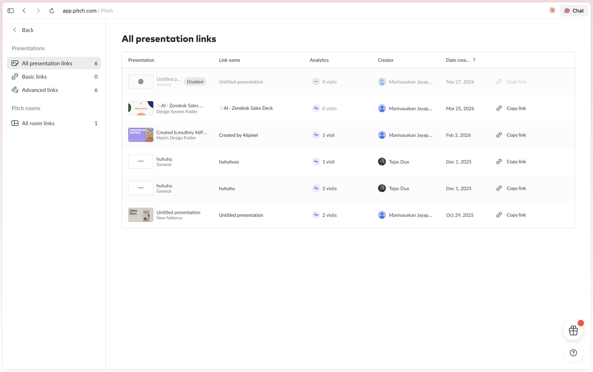
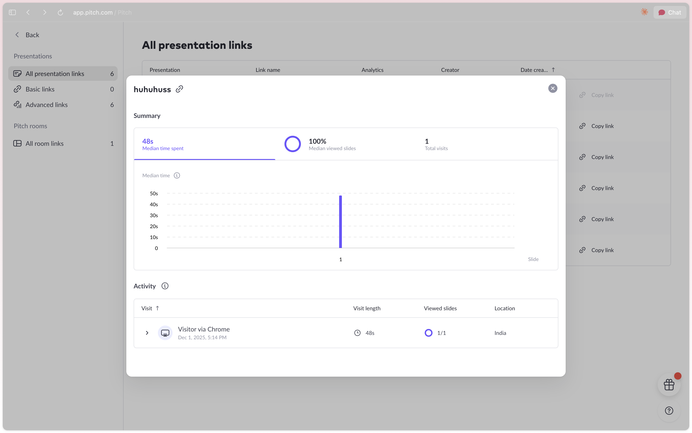
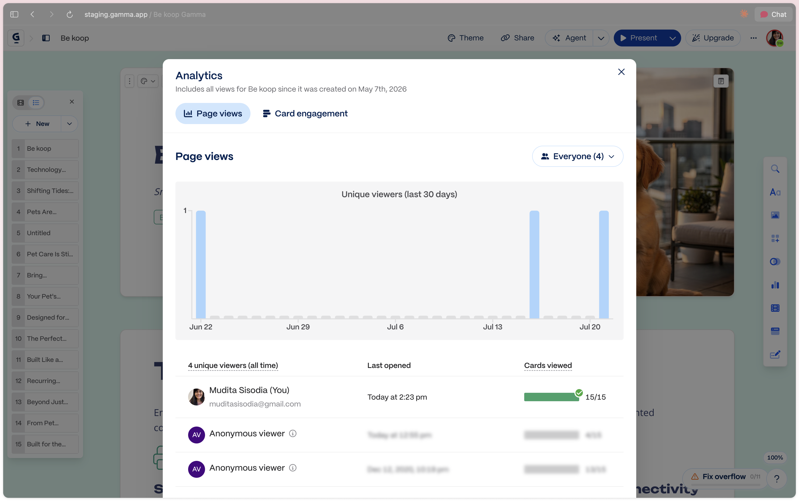
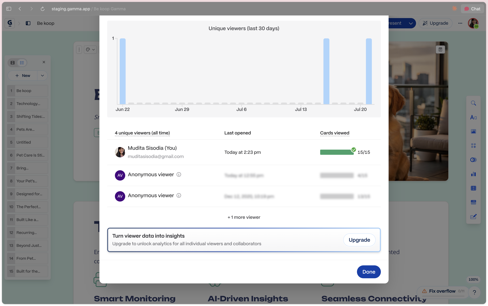
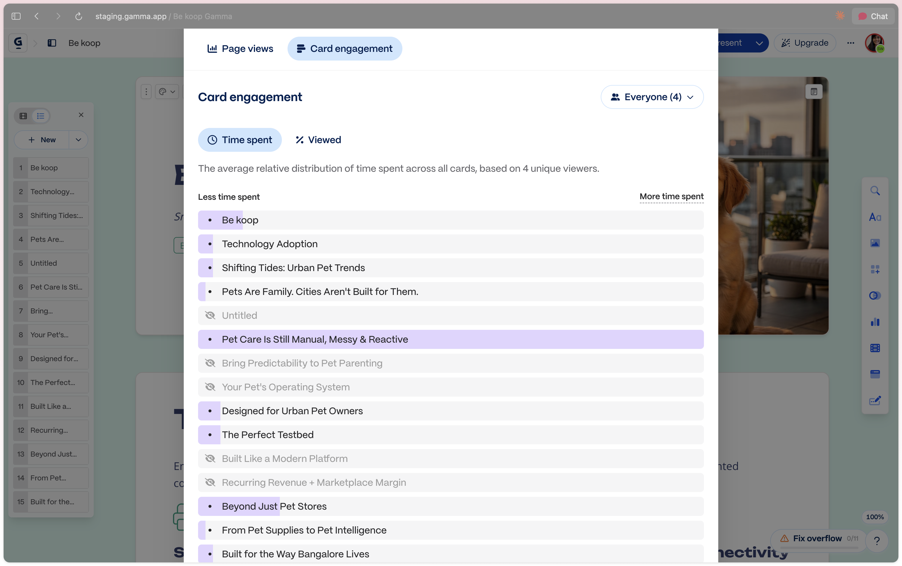

# Deck Analytics — grounding

**Type:** Shared grounding for this folder — reference, **not** source of truth · **Owner:** Mudita · **Updated:** 21 Jul 2026

Engagement analytics for **any shared deck, on any channel**. Analytics is the engine; the [Deal Room](../deal-room/grounding.html) is one consumer of it. This doc owns the tracked-link + identity + event-capture + dashboard layer.

---

## Who is this for?

Relevant to **three roles**, all *after* a deck exists and *when the user signals intent to share* (the Share button). Not part of the create flow.

| Role | What they share | What analytics gives them |
|---|---|---|
| **Sales** | proposals / decks to prospects (deal room, cold email, follow-up) | who engaged, forwarding, which slides — time follow-ups, gauge deal health |
| **Marketing** | published / broadcast decks (social, campaigns, embeds, newsletters) | reach, source, geo, completion — what content lands |
| **Leadership** | (portfolio view) team + content performance | which decks / teams perform — the roll-up (mostly Phase 2) |
| *Founders (adjacent)* | investor decks / fundraising sends | who opened, forwarded to partners, dwell on traction — fundraising signal |

**When it's relevant:**

```
CREATE FLOW  →  deck exists  →  user hits SHARE  ←── the signal that turns analytics on
(not here)                       │
                                 └─ a tracked link is born → analytics starts
```

---

## Who are the incumbents?

**DocSend** (Dropbox) is the canonical reference. **Pitch** ships share-link analytics on presentations. **Papermark** (open-source DocSend). Every DSR (Trumpet, Aligned) bundles engagement tracking too.

## What are they doing?

- **Tracked links** — a shareable link per doc/deck instead of an attachment.
- **Page/slide-level analytics** — time per page, drop-off, completion.
- **Per-viewer identity** (opt-in) — require email; see who viewed.
- **Forwarding signal** — a new viewer/domain = the deck traveled.
- **Link controls** — expiry, passcode, download on/off.
- **Notifications** — "someone viewed your doc."

## What's relevant to us?

Basically all of it — this *is* the feature. The parts we take:

- tracked link per deck, per-slide dwell + drop-off, completion
- per-viewer identity when known; **forwarding / new-viewer detection** (the flagship)
- aggregate reads for public decks (views, source, geo)
- link controls (expiry, revoke, download toggle) — gates opt-in, low by default
- first-open + new-viewer notifications

## What we play up (we're a presentation tool)

```
THEM: analytics on a deck they didn't make (a linked PDF they can't see into)
US:   analytics on a LIVE, NATIVE PAI deck we own end-to-end
```

- **Per-slide is native, not bolted on.** We already emit slide-level events — competitors reverse-engineer page views from a PDF; we have the real thing.
- **One surface: make → share → track.** No export, no second tool. The Share button on the deck you just built starts the analytics.
- **Distribution-agnostic from day one.** Same tracked link serves a social post, a cold email, and a deal room — because we own the deck object across all of them.

---

## Positioning (2×2)

A reference frame for where PAI sits and where these features move us. Axes chosen so **revenue is deliberately not one** (it's a lagging output, not a position):

```
X — MAKE the content ⟷ MOVE it       (creation ⟷ distribution & tracking)
Y — single artifact (point tool) ⟷   whole deal / revenue workflow (platform)
```

```
                    WHOLE DEAL / REVENUE WORKFLOW (platform)
                                   ▲
   ┌───────────────────────────────┼───────────────────────────────┐
   │  ░ WHITESPACE ░                │  Highspot · Seismic (enablmnt) │
   │  no deck-maker has a room —    │  PandaDoc · GetAccept (+e-sign)│
   │  the DEAL ROOM wedge           │  Trumpet·Aligned·Dock·Flowla·  │
   │  ↑ PAI heads up here           │  Recapped (DSR — deal workflow)│
 MAKE ─────────────────────────────┼───────────────────────────────── MOVE
   │ Pitch ··· Gamma · Beautiful.ai ····⟶ DocSend · Papermark       │
   │ (pure     Qwilr · Storydoc · ● PAI   (share + track one doc)   │
   │  create)  └─ ANALYTICS = table-stakes ─┘ (contested, not a wedge)│
   └───────────────────────────────┼───────────────────────────────┘
                                   ▼
                    SINGLE ARTIFACT (point tool)
```

**We sit bottom-left** with the deck-makers. Two different moves:

- **Analytics = table-stakes, not a wedge.** Gamma, Beautiful.ai and Qwilr already track — the creation corner has slid right into analytics. Ship it to complete the make→share→track loop and not look dated, but it won't differentiate PAI *from them*. (Beautiful.ai has even added Salesforce — the first step onto the diagonal.)
- **The Deal Room IS the wedge.** No deck-maker has a room + MAP; it's creation-side whitespace, *and* the move the DSRs can't easily counter (no native deck). PAI and the DSRs approach that space from **opposite corners** — they have the workflow but can't make a deck; we make the deck and add the workflow. Creation is the harder half to bolt on, so the creation corner is the stronger launch position.

---

## The analytics model (one deck, one link)

**Decided 21 Jul 2026.** A deck has **one** shareable tracked link — not many. Share that link anywhere (social, cold email, embed); analytics aggregates every view to the deck. This is the **Gamma model (per-deck)**, chosen over Pitch's per-link for its simplicity.

```
DECK "Acme pitch"
 └─ ONE tracked link ─► share anywhere ─► DECK-LEVEL analytics
                                          (summary · per-slide · viewers)

 [ deal room ] wraps the deck as a SEPARATE surface, with its own
   room-scoped analytics (see the Deal Room grounding)
```

The **two contexts live on two surfaces, not two links**: the deck's own link (published / shared, mostly aggregate) and the deal room (per-person). There is no per-link split to manage, and no roll-up (nothing to roll up with one link). Multiple named links per deck (Pitch-style, with a deck roll-up) is a **Phase 2** power feature.

---

## Deck analytics — the deep view

What a deck's analytics screen contains. Panels **adapt to whether identity is known** (public/anonymous share vs a named audience):

```
SUMMARY (tiles)     views · unique viewers · median time · completion (slides viewed)
PER-SLIDE           time-per-slide (dwell) bar — which slides held attention
VIEWERS             who · last opened · slides viewed · ⚑new-viewer   [when identity known]
SOURCE / GEO        where views came from                            [public / anonymous shares]
TIMELINE            opens over time
```

- **Anonymous / public share** → show Summary + Per-slide + Source/Geo + Timeline; hide the viewer list (no identities to show).
- **Named audience** → add the Viewers list + per-person on top.

*(Cut for Phase 1: a standalone drop-off curve — per-slide dwell + completion already tell that story.)*

### Metrics (Phase 1)

```
view / open     a session where the deck was opened
unique viewer   a distinct identity (or device, if anonymous)
dwell / slide   active-tab time on a slide (idle capped)
completion      slides viewed / reached the last slide
revisit         same viewer opens again later
new viewer ⚑    a new identity on the link — esp. a new email domain = forwarded
```

### Notifications (Phase 1)

```
first open           "Sam opened Acme pitch"          in-app 🔔 + email
new viewer / forward "A new viewer opened it (⚑)"      in-app 🔔 + email
```
Milestones and digests → later.

---

## Touchpoints across the app

Entry is from the **editor** and **dashboard**, never the create flow. The **Share button is the primary signal.**

```
EDITOR                         DASHBOARD                         TOPBAR
[ Share ] ─► create tracked    "Analytics" tab (left nav)        🔔 bell
             link (analytics    └ snapshot: recently frequented   └ "X opened
             begins)              / shared decks + mini-stats        your deck"
[ ⋯ ] View analytics           └ click a deck → deep view         └ "forwarded to
                                  (per-slide heat, completion,        a new viewer"
                                  who, source, timeline)
deck card ⋯ menu → View analytics (from any deck list)
```

**Dashboard placement (your direction):** a new **Analytics** tab in the left side-panel nav (sits with Home · Created by Me). Landing = a **snapshot of your most recently frequented decks** with at-a-glance stats; click a deck to open its **deep view**.

```
LEFT NAV                 ANALYTICS TAB (landing)              DEEP VIEW (per deck)
─────────                ────────────────────────            ─────────────────────
Home                     ┌─ Acme pitch   ▁▃▅ 42 views ─┐     who · when · per-slide
Created by Me            ├─ Q3 board deck ▁▁▂ 8 views  ─┤ →   heat · drop-off curve
▸ Analytics  ◄ new       └─ Cold outreach ▅▅▇ 130 views┘     · completion · source · timeline
▸ Deal rooms ◄ new       (recent / frequented snapshot)
Templates …
```

---

## Phase 1 — features + user stories

Grouped by flow. Kept deliberately simple.

**Sharing a deck (its one tracked link)**
- As a user, I can hit Share on my deck to get its trackable link.
- As a user, I can set the link to expire, or revoke it.
- As a user, I can allow or block PDF download.
- As a user, I can optionally ask viewers for their name (skippable).

**Seeing a deck's analytics**
- As a user, I can see how many people viewed my deck (and how many unique).
- As a user, I can see which slides they spent time on.
- As a user, I can see the completion (how far viewers got).
- As a user, I can see *who* viewed it, when their identity is known.
- As a user, I can see when a new/unknown viewer opened it (it was forwarded).
- As a user, I can see where views came from (source + geo) for public shares.

**Getting notified**
- As a user, I get notified when someone first opens my deck.
- As a user, I get notified when a new/unknown viewer opens it.

**Finding analytics in the app**
- As a user, I can open an Analytics tab in the dashboard.
- As a user, I can see my recently shared / frequented decks at a glance.
- As a user, I can click a deck to open its deep analytics.
- As a user, I can open a deck's analytics from its card menu.

---

## Phase 2 and beyond (directions, not stories)

- **Multiple named links per deck** (Pitch-style per-link tracking + a deck roll-up) — the power feature deferred from the one-link Phase 1
- **Standalone drop-off curve** (beyond per-slide dwell + completion)
- CRM write-back — engagement logged to Salesforce / HubSpot
- Team + account roll-up; leadership performance dashboards
- A/B deck comparison
- Predictive intent / deal scoring
- Session replay / scrub of a viewing session
- Verified email gate (Level 3), allowlist / SSO, password
- Per-recipient tracking for marketing broadcasts (UTM stitching)
- "Your decks" benchmarks (this deck vs your average)
- Deeper per-content-type analytics (video watch %, PDF page depth)

---

## Reference: Pitch analytics (screenshots)

Pitch's live implementation, captured 21 Jul 2026. Pitch uses a **per-link** model — **which we did NOT adopt for Phase 1** (we chose one-deck-one-link, Gamma-style; see *The analytics model* above). Kept here because Pitch's per-link approach is our **Phase 2** power-feature reference, and its deep-view metrics are a strong read regardless of the link model.

**All presentation links** — the list view. In Pitch, one deck can have several named links, each with its own visit count; links can be **Basic** (untracked) vs **Advanced** (analytics-tracked), and **room links** are a separate bucket. This is the per-link model we deferred to Phase 2.



Notable: columns are Presentation (thumb + folder) · Link name · Analytics (sparkline + N visits) · Creator · Date · Copy link. A link can be **Disabled**. The same deck appears under multiple link names with different visit counts.

**A link's analytics detail** — the deep view. Summary tiles (**median time spent · median viewed slides (completion) · total visits**), a **per-slide time chart**, and an **Activity** list of individual visits (visitor + device, visit length, viewed slides, location), each expandable.



Notable for our metric set: Pitch uses **median** (not mean) time, **completion as "median viewed slides"**, per-visit rows carry **device + location**, and the per-slide chart is time-per-slide (our "dwell"). Anonymous visits show as "Visitor via Chrome" — matches our anonymous-allowed default.

---

## Reference: Gamma analytics (screenshots)

Gamma's live implementation, captured 21 Jul 2026. Gamma is **per-DECK, not per-link** — "Includes all views for [deck] since it was created," one aggregated analytics view per gamma. **This is the model we adopted for Phase 1** (one deck, one link; see *The analytics model* above). So these screenshots are the closest reference to what we're building.

**Page views** — two tabs (**Page views · Card engagement**), a viewer filter ("Everyone (4)"), a *unique-viewers-over-time* bar chart (last 30 days), and a list of unique viewers.



**Viewer list** — per viewer: name + email (or **Anonymous viewer**), **last opened**, and **cards viewed** as a completion bar (15/15 ✓). Note the monetization pattern: individual anonymous-viewer detail is **gated behind Upgrade** ("Turn viewer data into insights").



**Card engagement** — per-card (per-slide) heat, sub-tabs **Time spent · Viewed**. A "less ↔ more time spent" relative distribution bar per card, with un-viewed cards greyed (eye-off). This is Gamma's version of our per-slide dwell + drop-off.



Takeaways vs our scope: Gamma frames completion as **"cards viewed,"** shows viewers **named-or-anonymous** (same as our default), splits **page-level vs card-level** (≈ our summary vs per-slide), and **paywalls per-viewer identity** — a monetization cue worth noting. Its **one-link, per-deck** shape is what we adopted for Phase 1; per-link (Pitch-style) is our Phase 2.

---

## Reference

### Identity is inverse to reach

```
REACH   large  ●──────────────────────────────●  small
IDENTITY anonymous ●────────────────────────●  fully known

 public/social  marketing  embed  cold email  investor  deal room
 └── AGGREGATE reads ────────────┘  └──── PER-PERSON reads ────┘
    "how many, from where"            "who, which slide, forwarded?"
```

### Distribution taxonomy (channels a deck travels)

Deal room · public/social post · cold email (1:1) · investor send · embed (site/blog/Notion) · marketing broadcast (list/newsletter/link-in-bio) · post-meeting follow-up · in-person/QR. Same events; identity + gating shift per channel.

### Two read models

- **Aggregate** (public end) — views, unique visitors, source, geo, drop-off, completion.
- **Per-person** (targeted end) — who opened, per-slide dwell, revisits, forwarding.

### Metrics catalogue

```
UNIVERSAL     opens · unique viewers · per-slide dwell · completion %
              · drop-off curve · device · geo · source/referrer
PER-PERSON    who · their dwell · revisits · forwarding/new-viewer · CTA clicks
DERIVED       downloads (if allowed) · time-to-open (send → first view)
```

### Access friction dial (shared with rooms)

```
L0 open link · L1 soft name (skippable) · L2 email capture · L3 email verify
· L4 allowlist/SSO · L5 password
```
Gates fight forwarding (the best signal), so V1 keeps them **opt-in**, defaults low, never forces identity. Matches Pitch/Trumpet/Aligned.

---

## Decided (locked calls)

| Question | Decision |
|---|---|
| **Ships first, standalone** | Before the deal room; live value on any shared deck; de-risks the pipeline. |
| **Roles** | Sales · Marketing · Leadership (+ Founders adjacent). |
| **Link model** | **One deck = one tracked link** (Gamma-style, per-deck analytics). Multiple named links per deck (Pitch-style) + roll-up → Phase 2. |
| **Two contexts, two surfaces** | The deck's own link (published, mostly aggregate) + the deal room (per-person). Not two links on one deck. |
| **Phase 1 metric set** | views · unique viewers · per-slide dwell · completion (slides viewed) · revisit · new-viewer(forward). |
| **Deep view** | Per-deck: summary tiles + per-slide dwell + viewer list (when identity) + source/geo (public) + timeline. Panels adapt to identity. |
| **Source / geo** | **Kept** in Phase 1 (the Marketing/public value; shows on public shares). |
| **Drop-off curve** | **Cut** from Phase 1 — per-slide dwell + completion cover it (→ Phase 2). |
| **Notifications** | Phase 1 = first-open + new-viewer, in-app 🔔 + email. |
| **Email gate** | Skipped in V1; no verified gate on any channel. |
| **Anonymous viewing** | Allowed everywhere; identity is never a wall. |
| **Forwarding detection** | In scope, V1, non-negotiable. |
| **Reuse existing events** | Build on PAI's slide-view instrumentation; extend, don't rebuild. |
| **Dashboard home** | Own **Analytics** tab in the left nav; landing = recent-decks snapshot → deep view. |
| **Entry points** | Editor Share button (primary signal) + dashboard; not the create flow. |

## Open threads / TODO

- [ ] **Map to `presentation-services`** — slide-view / deck-share event schema, share-link primitive, notification plumbing.
- [ ] Define **per-slide dwell** (active-tab time vs raw; slide left open).
- [ ] Design the **share dialog** (likely the first spec).
- [ ] Design the **Analytics tab** — recent-decks snapshot + the deep per-deck view.
- [ ] Define **forwarding / new-viewer detection** mechanics without a hard gate.
- [ ] Decide **UTM / source attribution** for public + marketing channels.
- [ ] Confirm the **anonymous → known** identity-stitch model.
